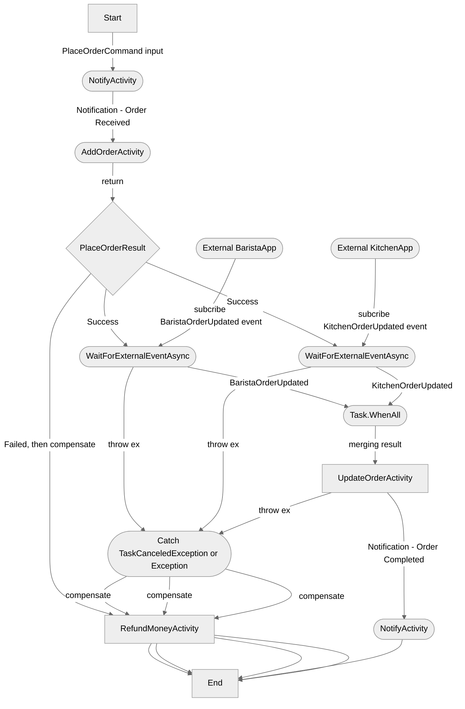

# Coffeeshop Dapr Workflow Demo

Opinionated coffeeshop application builds with Dapr workflow


## Place Order Workflow



## Build Docker Images

```sh
make publish-all-dockers
```

## Refs

- https://github.com/davidfowl/TodoApi/blob/davidfowl/net8/README.md
- https://github.com/thangchung/dapr-labs