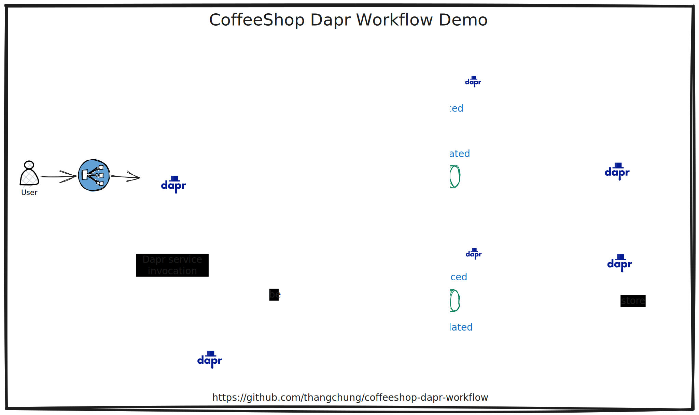

# Coffeeshop Dapr Workflow Demo

Opinionated coffeeshop application builds with Dapr workflow



## Place Order Workflow

```mermaid
%%{
    init: {
        'theme':'neutral'
    }
}%%

graph TB
    A[Start]
    A1([NotifyActivity])
    B([AddOrderActivity])
    C{PlaceOrderResult}
    
    EXTERNAL_BARISTA_APP([External BaristaApp])
    EXTERNAL_KITCHEN_APP([External KitchenApp])
    D([WaitForExternalEventAsync])
    E([WaitForExternalEventAsync])
    F([Task.WhenAll])
    G[UpdateOrderActivity]
    G1([NotifyActivity])
    
    Exception([Catch TaskCanceledException or Exception])

    H[RefundMoneyActivity]
    I[End]

    A --> |"PlaceOrderCommand input"| A1
    A1 --> |"Notification - Order Received"| B
    B --> |"return"| C
    C --> |"Success"| D -->|"BaristaOrderUpdated"| F
    EXTERNAL_BARISTA_APP --> |"subcribe BaristaOrderUpdated event"| D
    C --> |"Success"| E -->|"KitchenOrderUpdated"| F
    EXTERNAL_KITCHEN_APP --> |"subcribe KitchenOrderUpdated event"| E
    F --> |"merging result"| G --> |"Notification - Order Completed"| G1
    C --> |"Failed, then compensate"| H

    D --> |"throw ex"| Exception --> |"compensate"| H --> I
    E --> |"throw ex"| Exception --> |"compensate"| H --> I
    G --> |"throw ex"| Exception --> |"compensate"| H --> I

    G1 --> I
    H --> I
```



## Build Docker Images

```sh
make publish-all-dockers
```

Notes:

```sh
#.env
IMAGE_TAG=0.2.0
DAPR_URL=http://localhost:3500
```

## Radius

```sh
> kubectl get no
NAME                       STATUS   ROLES                  AGE   VERSION
k3d-k3s-default-server-0   Ready    control-plane,master   49m   v1.27.4+k3s1
```

```sh
> rad install kubernetes
Installing Radius version v0.26.9 to namespace: radius-system...
```

```sh
# in case, we want a clean version
> k3d cluster delete k3d-k3s-default
> k3d cluster create k3d-k3s-default
```

```sh
> rad init
```

```sh
# for testing only
> dapr init -k
# dapr init --runtime-version 1.11.0 -k
```

```sh
> rad run app.bicep
```

```sh
# clean up
> rad app delete coffeeshop-dapr-workflow
```

## Refs

- https://github.com/davidfowl/TodoApi/blob/davidfowl/net8/README.md
- https://github.com/thangchung/dapr-labs